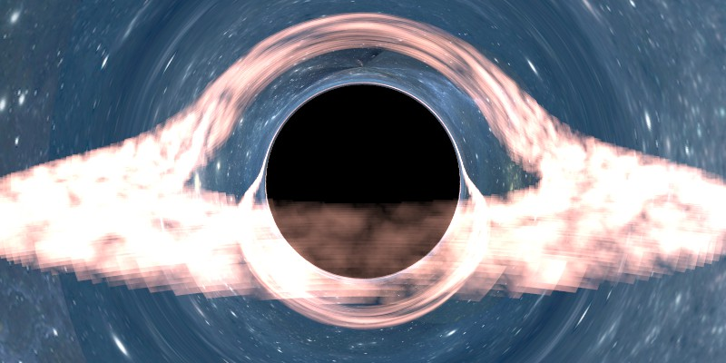

软光线步进算法渲染黑洞
基于raytracing渲染器
编译器：VS2022
语言：C++
光线步进算法-欧拉法
物理：黑洞的施瓦西解

目前的效果：

todo：
体积云的效果优化
函数的封装
写一篇文章

参考：
https://www.codeproject.com/Articles/994466/Ray-Tracing-a-Black-Hole-in-Csharp
https://www.cnblogs.com/GuyaWeiren/p/15376286.html
https://github.com/RenChiyu/UnityBlackHole/blob/main/Assets/Resources/BlackHole.shader
https://zhuanlan.zhihu.com/p/128685960
https://zhuanlan.zhihu.com/p/128685960
https://zhuanlan.zhihu.com/p/129745508
https://zhuanlan.zhihu.com/p/129372723
https://zhuanlan.zhihu.com/p/105531637
https://zhuanlan.zhihu.com/p/220685254
https://www.bilibili.com/video/BV19a4y17721/?spm_id_from=333.337.search-card.all.click&vd_source=25028cc98e6a1a7a64742bfb8458cd8a
https://blog.csdn.net/weixin_44176696/article/details/113090350
https://zhuanlan.zhihu.com/p/622654876
https://zhuanlan.zhihu.com/p/622654876
